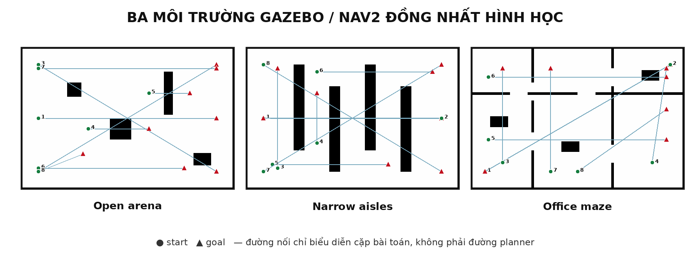
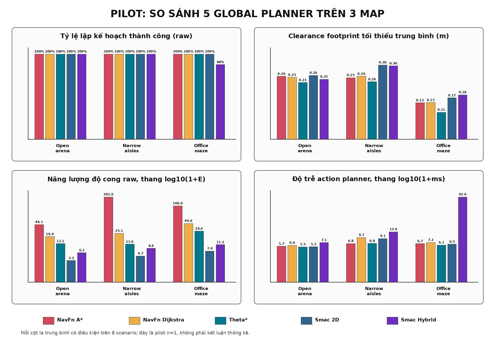

# So sánh global planner Nav2 trên nhiều map Gazebo

## Phạm vi đã triển khai

Workspace hiện nạp đồng thời năm planner qua `planner_server`:

| ID dùng trong lệnh | Plugin Nav2 | Vai trò |
|---|---|---|
| `NavFnAStar` | `nav2_navfn_planner::NavfnPlanner` | A* trên lưới 2D |
| `NavFnDijkstra` | `nav2_navfn_planner::NavfnPlanner` | Dijkstra trên lưới 2D |
| `ThetaStar` | `nav2_theta_star_planner::ThetaStarPlanner` | đường any-angle trên lưới |
| `Smac2D` | `nav2_smac_planner::SmacPlanner2D` | tìm kiếm 2D có xét cost; có hậu xử lý nội bộ |
| `SmacHybrid` | `nav2_smac_planner::SmacPlannerHybrid` | Hybrid-A* SE(2), Dubins tiến-only, bán kính quay tối thiểu 0,35 m |

Ba bộ SDF–PGM–scenario mới được sinh từ cùng một nguồn hình học:



- `open_arena`: vật cản thưa, kiểm tra đường dài, đường chéo và detour đơn;
- `narrow_aisles`: bốn dãy kệ lệch nhau, kiểm tra clearance và zig-zag;
- `office_maze`: vách có cửa lệch, kiểm tra L-turn, U-turn và failure mode.

Mỗi map có 8 cặp start–goal cố định. Script
`tools/generate_planner_map_assets.py` tái tạo hai hình trong tài liệu; script
`src/vacuum_robot_gazebo/scripts/generate_benchmark_environments.py` tái tạo
world, map và YAML scenario. Test regression so sánh byte-for-byte đầu ra của
generator với file đã commit, kiểm tra kích thước map, metadata, điểm đầu/đích
và khả năng nối đường với biên an toàn 0,22 m.

## Quy tắc so sánh

Hai câu hỏi được tách riêng để tránh trộn hiệu ứng:

1. So sánh planner chỉ dùng dòng `method=raw`.
2. So sánh smoother chỉ thực hiện trong cùng
   `planner/scenario/repetition/raw_path_sha256`.

Mọi smoother nhận cùng một bản sao đường planner đã chuẩn hóa. Chuẩn hóa chỉ
xóa pose liên tiếp trùng cả vị trí lẫn hướng; pose quay tại chỗ có thay đổi
hướng vẫn được giữ. Hash trước và sau chuẩn hóa đều được lưu.

Các lưu ý bắt buộc khi diễn giải:

- Smac 2D trên Nav2 Jazzy có smoother nhẹ bên trong và không có công tắc tắt;
  hậu xử lý đó được xem là một phần của planner.
- Smac Hybrid dùng mô hình Dubins tiến-only, trong khi xe vi sai có thể quay tại
  chỗ. Nó là baseline ràng buộc độ cong, không phải mô hình động học tương đương.
- `wall_time_s` gồm action/DDS overhead. `planning_time` dùng clock mô phỏng có
  độ phân giải thô trong các path rất nhanh; pilot vì vậy ưu tiên wall time và
  chưa dùng để claim tốc độ CPU.
- Các bảng dưới đây mới có một lượt cho mỗi scenario (`n=1`), chỉ xác nhận
  pipeline và nhận diện failure mode, chưa dùng cho kiểm định thống kê.

## Kết quả pilot hình học



Số liệu dưới đây chỉ lấy raw path. Độ dài, clearance, năng lượng độ cong và wall
time là trung bình có điều kiện trên các plan thành công.

| Map | Planner | Thành công | Độ dài (m) | Clearance min TB (m) | `∫κ²ds` raw | Wall time (ms) |
|---|---|---:|---:|---:|---:|---:|
| Open arena | NavFn A* | 8/8 | 8,173 | 0,258 | 46,080 | 5,68 |
| Open arena | NavFn Dijkstra | 8/8 | 8,123 | 0,254 | 19,908 | 6,04 |
| Open arena | Theta* | 8/8 | **8,065** | 0,233 | 12,135 | 5,49 |
| Open arena | Smac 2D | 8/8 | 8,115 | **0,262** | **3,209** | 5,51 |
| Open arena | Smac Hybrid | 8/8 | 8,160 | 0,246 | 6,128 | 7,13 |
| Narrow aisles | NavFn A* | 8/8 | 9,965 | 0,253 | 301,576 | 6,76 |
| Narrow aisles | NavFn Dijkstra | 8/8 | 9,793 | 0,258 | 25,066 | 9,66 |
| Narrow aisles | Theta* | 8/8 | **9,729** | 0,236 | 11,593 | 6,82 |
| Narrow aisles | Smac 2D | 8/8 | 9,875 | **0,305** | **4,723** | 9,07 |
| Narrow aisles | Smac Hybrid | 8/8 | 9,894 | 0,301 | 8,581 | 13,44 |
| Office maze | NavFn A* | 8/8 | 9,974 | 0,149 | 165,974 | 6,68 |
| Office maze | NavFn Dijkstra | 8/8 | 9,828 | 0,150 | 49,588 | 7,20 |
| Office maze | Theta* | 8/8 | 9,747 | 0,110 | 29,380 | **6,13** |
| Office maze | Smac 2D | 8/8 | 9,822 | 0,170 | **6,971** | 6,50 |
| Office maze | Smac Hybrid | 7/8 | **9,744** | **0,182** | 11,173 | 92,00 |

Các kết quả quan trọng:

- Open arena và narrow aisles đạt 240/240 dòng
  planner–smoother thành công.
- Office maze đạt 228/240. Một bài `upper_cross_offices` cố ý rất hẹp:
  Smac Hybrid không tìm được đường với Dubins tiến-only; ba smoother Nav2 làm
  đường NavFn A* va chạm; Pivot–G2 độc lập không tìm được maneuver an toàn trên
  ba raw path.
- `adaptive_hybrid` không thất bại ở các raw path vẫn an toàn. Nếu Simple và
  Pivot–G2 đều bị safety gate loại, nó trả lại raw path đã kiểm tra swept
  footprint và ghi lý do `smoothed_candidates_unsafe_raw_fallback`.
- Cấu hình cũ của Constrained Smoother downsample mỗi hai pose. Một đoạn NavFn
  dạng A–B–A bị alias thành A–A và tạo residual NaN trong Ceres. Đặt
  `path_downsampling_factor: 1` đã loại lỗi; narrow aisles sau sửa đạt 240/240.

Các khác biệt này là tín hiệu để thiết kế test set, chưa phải bằng chứng planner
nào tốt nhất. Đặc biệt, năng lượng độ cong thấp của Smac 2D có một phần từ
smoother nội bộ của chính planner.

## Smoke test vòng kín

Trên `open_arena/short_open_diagonal`, mỗi planner chạy raw path trong một ROS
domain và Gazebo partition mới. Cả 5/5 lượt đều được Nav2 controller báo thành
công và ground truth Gazebo xác nhận đích.

| Planner | Thời gian (s) | Tracking RMSE (m) | Sai số đích (m) | Sai số yaw (rad) |
|---|---:|---:|---:|---:|
| NavFn A* | 37,629 | 0,0110 | 0,0403 | 0,0926 |
| NavFn Dijkstra | 37,185 | 0,0103 | 0,0323 | 0,0203 |
| Theta* | **36,486** | 0,0136 | 0,0468 | **0,0390** |
| Smac 2D | 39,300 | 0,0229 | 0,0362 | 0,0763 |
| Smac Hybrid | 37,152 | **0,0053** | **0,0254** | 0,0556 |

Đây chỉ là smoke test một lượt. Không được dùng các giá trị tốt nhất in đậm để
claim ưu thế nếu chưa chạy tối thiểu 10 lượt trên nhiều scenario.

## Cách chạy

Build:

```bash
cd /home/linh-pham/agv_nav2_research_ws
source /opt/ros/jazzy/setup.bash
colcon build --symlink-install
source install/setup.bash
```

Xem xe trên một map và chọn planner cho các goal RViz2:

```bash
ros2 launch vacuum_robot_gazebo simulation.launch.py \
  environment:=narrow_aisles planner_id:=Smac2D \
  execute:=true execute_method:=adaptive_hybrid
```

Batch hình học tự mở đúng environment từ scenario YAML và tắt stack khi xong:

```bash
ros2 launch adaptive_pivot_g2_benchmark planner_benchmark.launch.py \
  scenario_file:=$PWD/src/adaptive_pivot_g2_benchmark/config/office_maze_scenarios.yaml \
  output_csv:=$PWD/results/office_planners.csv \
  output_json:=$PWD/results/office_planners_summary.json
```

Ma trận vòng kín tự đọc environment từ scenario YAML và cô lập từng trial:

```bash
ros2 run adaptive_pivot_g2_benchmark execution_matrix -- \
  --scenario-file "$PWD/src/adaptive_pivot_g2_benchmark/config/open_arena_scenarios.yaml" \
  --scenario short_open_diagonal \
  --planners NavFnAStar NavFnDijkstra ThetaStar Smac2D SmacHybrid \
  --methods raw adaptive_hybrid \
  --repetitions 10 \
  --output-dir "$PWD/results/open_arena_execution"
```

## Phần chưa làm

- Chưa thêm Smac Lattice vì workspace chưa có motion-primitives JSON được thiết
  kế và kiểm chứng cho footprint 0,44 × 0,34 m. Dùng file mẫu không khớp robot
  sẽ làm so sánh sai.
- Ba map mới chỉ có 8 scenario/map; benchmark bài báo cần khóa train/test split,
  tăng số cặp và lặp vòng kín.
- Chưa randomized thứ tự planner/method và chưa thu CPU load, commit SHA,
  params hash, seed trong từng row.
- Chưa chạy robot thật với GA25 encoder 1320 tick/vòng, A1M8 và BNO055.

Tài liệu Nav2 chính thức: [danh sách plugin](https://docs.nav2.org/plugins/),
[Smac Planner](https://docs.nav2.org/configuration/packages/configuring-smac-planner.html)
và [hướng dẫn chọn thuật toán](https://docs.nav2.org/setup_guides/algorithm/select_algorithm.html).
