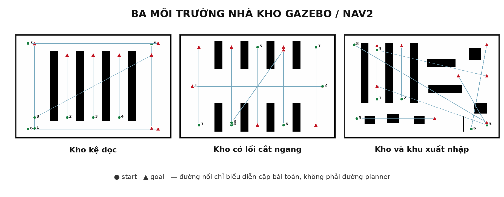

# Bộ môi trường Gazebo dành cho robot trong nhà kho

## Ba layout đã bổ sung

Ba map dưới đây được thiết kế cho robot vi sai 440 × 340 mm. SDF Gazebo, ảnh
occupancy PGM và YAML Nav2 đều được sinh từ cùng danh sách collision box, vì vậy
vị trí kệ và pallet không bị lệch giữa mô phỏng vật lý và planner.



| Environment | Cấu trúc | Tình huống chính |
|---|---|---|
| `warehouse_long_aisles` | 4 dãy kệ 0,6 × 5,4 m; lối giữa hai mặt kệ rộng 1,4 m; hành lang chuyển hàng ở hai đầu | chạy dọc lối lấy hàng, đổi lối ở cuối kệ, vận chuyển chéo toàn kho |
| `warehouse_cross_aisles` | 8 đoạn kệ tạo 5 lối dọc và một lối cắt ngang rộng 2,6 m | chuyển hàng giữa hai nửa kho, rẽ 90 độ tại giao lối |
| `warehouse_dispatch` | khu kệ lưu trữ, pallet đầu vào, kệ staging, pallet đầu ra và làn dispatch | slalom qua pallet, đưa hàng từ kệ ra staging, đi giữa khu nhận và xuất hàng |

Mỗi map có 8 cặp start–goal cố định. Generator kiểm tra start/goal không nằm
trong vật cản và có đường nối trên lưới sau khi nở vật cản thêm 0,22 m. Đây là
biên kiểm tra bảo thủ so với nửa bề rộng 0,17 m của xe.

## Smoke test planner và smoother

Mỗi map chạy 5 planner × 8 scenario × 6 đầu ra gồm raw, Simple,
Savitzky–Golay, Constrained, Pivot–G2 và Adaptive Hybrid. Cả ba map đều đạt
240/240, tổng cộng 720/720 phép thử thành công.

Bảng dưới chỉ lấy raw path để không trộn chất lượng planner với smoother. Các
giá trị là trung bình của 8 scenario, một lượt mỗi scenario.

| Map | Planner | Thành công | Độ dài (m) | Clearance min TB (m) | `∫κ²ds` raw | Wall time (ms) |
|---|---|---:|---:|---:|---:|---:|
| Kệ dọc | NavFn A* | 8/8 | 7,684 | 0,371 | 15,696 | 5,22 |
| Kệ dọc | NavFn Dijkstra | 8/8 | 7,679 | 0,372 | 3,817 | 6,22 |
| Kệ dọc | Theta* | 8/8 | **7,661** | 0,356 | 1,858 | 4,43 |
| Kệ dọc | Smac 2D | 8/8 | 7,672 | 0,422 | **0,567** | 4,74 |
| Kệ dọc | Smac Hybrid | 8/8 | 7,702 | **0,430** | 1,675 | **3,92** |
| Lối cắt ngang | NavFn A* | 8/8 | 7,234 | 0,490 | 10,531 | 7,40 |
| Lối cắt ngang | NavFn Dijkstra | 8/8 | 7,206 | 0,490 | 6,583 | 5,89 |
| Lối cắt ngang | Theta* | 8/8 | **7,193** | 0,475 | 1,819 | 3,98 |
| Lối cắt ngang | Smac 2D | 8/8 | 7,212 | **0,552** | **0,673** | 3,94 |
| Lối cắt ngang | Smac Hybrid | 8/8 | 7,205 | 0,550 | 1,080 | **3,25** |
| Khu xuất nhập | NavFn A* | 8/8 | 8,434 | 0,174 | 77,291 | 6,29 |
| Khu xuất nhập | NavFn Dijkstra | 8/8 | 8,404 | 0,181 | 42,793 | 9,76 |
| Khu xuất nhập | Theta* | 8/8 | **7,737** | 0,121 | 34,028 | **4,96** |
| Khu xuất nhập | Smac 2D | 8/8 | 7,839 | **0,228** | **3,937** | 5,83 |
| Khu xuất nhập | Smac Hybrid | 8/8 | 8,299 | 0,201 | 9,171 | 8,09 |

Khu xuất nhập tạo khác biệt rõ nhất: Theta* cho đường ngắn nhưng đi sát vật cản
hơn, trong khi Smac 2D giữ clearance trung bình lớn hơn và năng lượng độ cong
raw thấp hơn. Đây mới là pilot `n=1`, chưa phải kết luận planner nào tốt nhất.

## Smoke test xe chạy trong Gazebo

Một lượt Theta* + Adaptive Hybrid được thực thi trên mỗi map. Success yêu cầu
cả Nav2 controller và ground truth Gazebo đạt đích trong 0,10 m và 0,15 rad.

| Map/scenario | Success | Thời gian (s) | Tracking RMSE (m) | Sai số đích (m) | Sai số yaw (rad) | Collision monitor |
|---|---:|---:|---:|---:|---:|---:|
| Kệ dọc / `picking_aisle_a` | Có | 62,667 | 0,0152 | 0,0628 | 0,0035 | 0 |
| Lối cắt / `cross_aisle_transfer` | Có | 98,991 | 0,0134 | 0,0608 | 0,0819 | 0 |
| Xuất nhập / `inbound_to_staging` | Có | 69,174 | 0,0242 | 0,0781 | 0,1025 | 0 |

Các lượt này chứng minh pipeline có thể điều khiển xe trong ba layout, nhưng
vẫn chỉ là smoke test một lượt. Thực nghiệm bài báo cần ít nhất 10 lượt cho từng
planner–smoother được chọn và phải tách tập tuning/held-out.

## Cách xem xe chạy

Ví dụ đặt xe trong lối lấy hàng của kho kệ dọc:

```bash
cd /home/linh-pham/agv_nav2_research_ws
source /opt/ros/jazzy/setup.bash
colcon build --symlink-install
source install/setup.bash

ros2 launch vacuum_robot_gazebo simulation.launch.py \
  environment:=warehouse_long_aisles \
  planner_id:=ThetaStar \
  execute:=true \
  execute_method:=adaptive_hybrid \
  x_pose:=-2.0 y_pose:=-2.4 yaw:=1.5708
```

Trong RViz2, chọn **2D Goal Pose** rồi đặt goal trong phần trắng của map.

Đổi map bằng một trong:

```text
warehouse_long_aisles
warehouse_cross_aisles
warehouse_dispatch
```

Chạy benchmark hình học tự động:

```bash
ros2 launch adaptive_pivot_g2_benchmark planner_benchmark.launch.py \
  scenario_file:=$PWD/src/adaptive_pivot_g2_benchmark/config/warehouse_dispatch_scenarios.yaml \
  output_csv:=$PWD/results/warehouse_dispatch.csv \
  output_json:=$PWD/results/warehouse_dispatch_summary.json
```

Các file sinh map nằm trong
`src/vacuum_robot_gazebo/scripts/generate_benchmark_environments.py`; chỉnh sửa
layout tại đây rồi chạy lại script để cập nhật đồng thời SDF, PGM và scenario.
